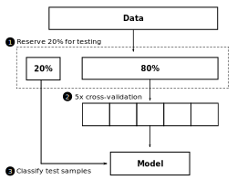

# Colorectal Cancer (CRC) Prediction Models

CRC prediction models built using a publicly available dual-feature dataset consisting of microbiomics and metabolomics data.

The datasets were obtained from the the publication: [Fecal Microbiota, Fecal Metabolome, and Colorectal Cancer Interrelations, by Sinha et al.](https://journals.plos.org/plosone/article?id=10.1371/journal.pone.0152126)

## Classifiers trained

The code for the various models built is presented in the form of Jupyter and R markdown notebooks:

- penalized logistic regression (lasso, ridge, and elastic net): [penalized_regression.Rmd](penalized_regression.Rmd)
- linear discriminant analysis: [LDA]
- random forests
- fully connected neural network

## Model building workflow

Classifier performance is evaluated using and accuracy score, balanced accuracy score, and AUC/ROC.

## [Read the report](pdf_reports/analysis-human-gut.pdf)
